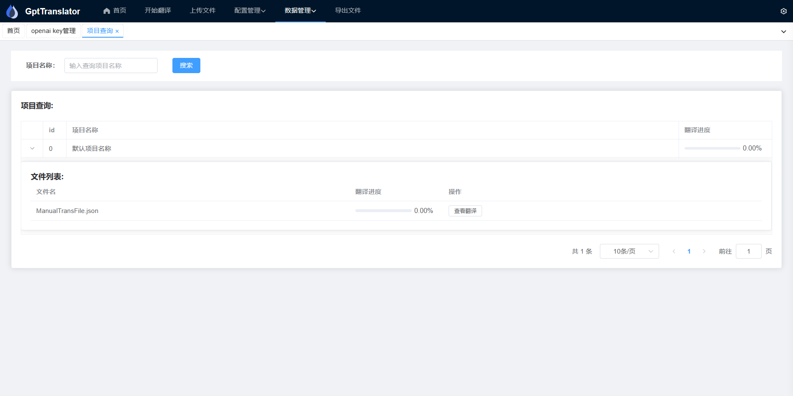

# GPT-Translator

## 项目介绍

GPT-Translator 是一款前后端分离基于 OpenAI 的高效翻译软件。这个工具可以读取 JSON 和 Excel(zip) 文件，然后进行行翻译，并输出结果。GPT-Translator 集成了需要翻译项目管理和 OpenAI 配置管理，是一款为复杂的多语言翻译项目量身定制的工具。(改文本当前为第一版,后续将持续更新)

### 主要功能

- **JSON 和 Excel 文件读取**：GPT-Translator 可以读取并解析 JSON 和 Excel 文件，为后续的翻译工作做准备。

- **OpenAI 翻译**：使用 OpenAI 的翻译 API，GPT-Translator 能够提供高质量的自动翻译。

- **项目管理**：GPT-Translator 提供了项目管理功能，帮助用户有效地管理和追踪翻译项目。

- **OpenAI 配置管理**：用户可以在 GPT-Translator 中配置和管理 OpenAI 的设置，使得使用更加便捷。

## 实现技术

GPT-Translator 使用以下技术进行开发和实现：

- **语言/框架**： java springboot3.0.1 vue3

- **OpenAI API**：GPT-Translator 使用 OpenAI 的 GPT-3.5 进行自动翻译。

- **项目管理**：GPT-Translator 使用 hsqldb,mariadb 进行项目管理。

## 如何使用

这里可以提供一些关于如何安装和使用 GPT-Translator 的基本信息和指南。你可以添加一些关于如何配置 OpenAI 设置，如何上传和处理文件，以及如何使用项目管理功能的详细步骤(后续不断完善中)。

### 开始使用
1. 下载项目:https://github.com/XHXJ/json-GPT-translator/releases
2. 通过 MTool 或 Translator++ 导出需要翻译的json和excel文件: 
3. 导入json和excel文件到GPT-Translator
4. 在key管理页面,配置您的 OpenAI API KEY
5. 点击开始翻译中的开始翻译按钮,等待翻译完成
6. 查看导出文件决定导出json还是excel文件

### MTool (导出需要翻译的json)

1. 打开你的 MTool 软件并选取需要翻译的游戏,在翻译栏点击导出需要被翻译的文本
2. 将导出的json上传到GPT-Translator

### Translator++ (导出需要翻译的excel并打包zip)
1. 打开你的 Translator++ 软件并选取需要翻译的游戏,在翻译栏点击导出工程选择XML(.xlsx)格式

2. 将导出的excel打包成zip上传到GPT-Translator

## 项目预览
### 上传文件

### key管理

### chagpt管理

### 测试

### 项目查询

### 翻译查询

### 导出文件

## 关于项目
本人是一名java程序员，本来是想编写一个自己使用的翻译工具，因只能通过自己休息时间来编写，所以进度比较慢。想把这个软件作为翻译工作前期快速翻译的工具,后续还是需要人工润色和修改不合适的翻译句子,gpt并不能一劳永株的解决问题.

## 贡献

如果你对 GPT-Translator 的开发感兴趣，欢迎提出问题，提交拉取请求，或者直接参与到我们的开发工作中来。 你也可以加入 QQ 群：`548161149` 注意该群只做技术讨论交流,并不处理使用中出现的问题,如果需要反馈问题请详细描述问题提出 issues .
